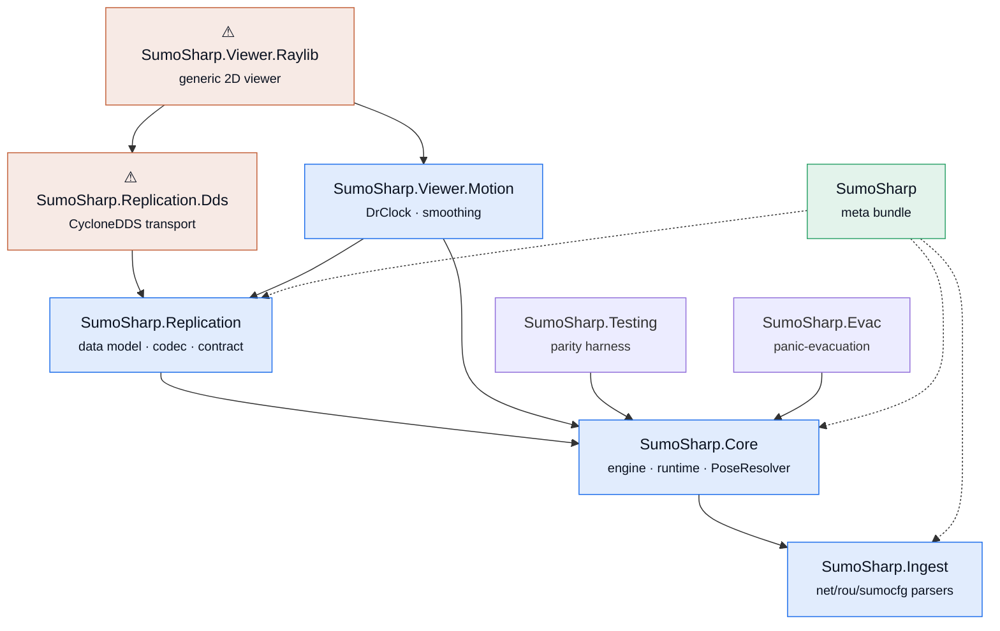
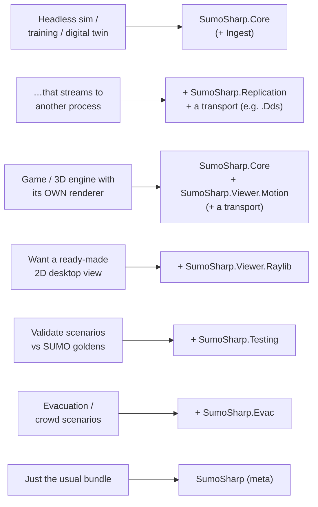
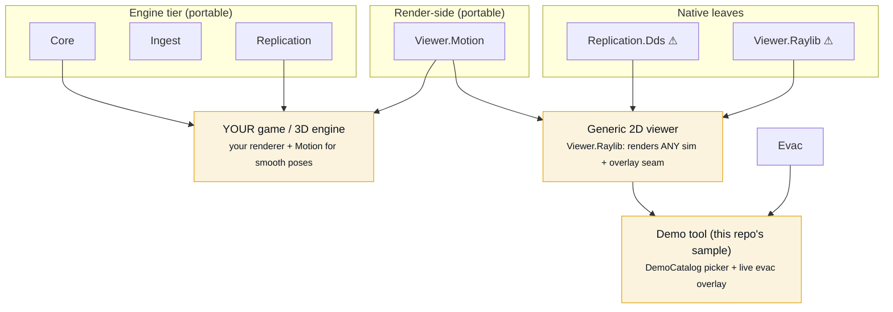
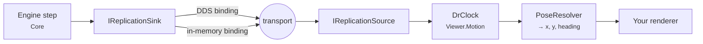

# SumoSharp packages — what to install and how they fit together

**SumoSharp** is SUMO's microscopic traffic simulation, reimplemented in C#/.NET 8. It ships as a
set of **small, layered NuGet packages** so you take only what you need: the engine alone, the
engine plus streaming, the render-side motion math for your own renderer, or the batteries-included
desktop viewer. Native/heavy dependencies (DDS, raylib) are quarantined in leaf packages you opt
into — the engine core stays portable (`net8.0` **and** `netstandard2.1`, so Unity/Godot can consume
it).

> **Unofficial, independent reimplementation of Eclipse SUMO's microscopic simulation core. Not
> affiliated with or endorsed by the Eclipse SUMO project.** Dual-licensed
> `EPL-2.0 OR GPL-2.0-or-later` (see [Licensing](#licensing)).

---

## The package map

Arrows mean **"depends on."** ⚠ marks a **native** package (pulls a platform-specific binary);
everything else is pure managed. Blue = portable (`net8.0`+`netstandard2.1`); grey = `net8.0`-only.



| Package | What it is | TFMs | Native? | Depends on |
|---|---|---|:--:|---|
| **`SumoSharp.Core`** | The simulation engine: stepping, obstacle store, columnar read surface, runtime spawn/reroute, `SimulationRunner`, `PoseResolver`. | net8.0 · ns2.1 | — | Ingest |
| **`SumoSharp.Ingest`** | Parsers + model for SUMO `.net.xml` / `.rou.xml` / `.sumocfg`. | net8.0 · ns2.1 | — | — |
| **`SumoSharp.Replication`** | The **replication API**: wire data model (`VehicleRecord` …), packed codec, publish policy, and the transport contract `IReplicationSink`/`IReplicationSource`. | net8.0 · ns2.1 | — | Core |
| **`SumoSharp.Replication.Dds`** ⚠ | A **CycloneDDS binding** of the replication contract. One transport option among several. | net8.0 | native | Replication |
| **`SumoSharp.Viewer.Motion`** | Portable **render-side motion reconstruction**: `DrClock` + `DrPoseSmoother` turn sparse samples into smooth per-frame poses. No renderer, no transport. | net8.0 · ns2.1 | — | Core, Replication |
| **`SumoSharp.Viewer.Raylib`** ⚠ | A **generic** raylib desktop viewer that renders any SUMO stream, with a render-overlay seam. | net8.0 | native | Viewer.Motion, Replication.Dds |
| **`SumoSharp.Testing`** | Parity harness: FCD/tripinfo/summary parsers + tolerance comparators. Validate your own scenarios vs SUMO goldens. | net8.0 | — | Core |
| **`SumoSharp.Evac`** | Optional **panic-evacuation** domain extension over Core's seams (parity-exempt). | net8.0 | — | Core |
| **`SumoSharp`** | Convenience **meta-package**: installs the simulate-and-stream core (Core + Ingest + Replication). | ns2.1 | — | (deps only) |

---

## Which packages do I install?



| You are… | Install |
|---|---|
| A headless simulation / training / digital-twin backend | `SumoSharp.Core` (pulls `Ingest`) |
| …and you stream state to a decoupled process | `+ SumoSharp.Replication` + a transport binding (e.g. `SumoSharp.Replication.Dds`) |
| **A game / 3D engine with its own renderer** | `SumoSharp.Core` + `SumoSharp.Viewer.Motion` (+ a transport) |
| Someone who wants the batteries-included generic 2D viewer | `+ SumoSharp.Viewer.Raylib` |
| Validating your own networks against SUMO output | `+ SumoSharp.Testing` |
| Running evacuation / crowd scenarios | `+ SumoSharp.Evac` |
| "Just give me the usual" | `SumoSharp` (meta) |

---

## How the blocks compose into final parts

The packages are building blocks. Here's how they assemble into the things you actually run — your
own game integration, the generic viewer, and the demo tool that ships in this repo.



Key idea: the **generic viewer** (`SumoSharp.Viewer.Raylib`) knows nothing about evacuation or
curated demos. Domain visuals (evac) and the scenario picker live in the **demo tool** — a *sample*,
not a package — and plug into the viewer through a generic render-overlay seam (`IRenderOverlay`).
Your own game does the same: take `Core` + `Viewer.Motion`, draw with your engine's renderer.

### The streaming / motion data flow

When the renderer is decoupled from the engine (another process, or a networked client), the
replication contract carries state and `Viewer.Motion` reconstructs smooth motion from it:



`IReplicationSink`/`IReplicationSource` live in `SumoSharp.Replication` (the API); **DDS is one
binding**, an in-process bus is another, and a WebSocket/pipe/ENet transport would be a third — your
consumer code talks to the interface, never to a DDS type.

---

## Getting started

Install the engine (this pulls `SumoSharp.Ingest` automatically):

```bash
dotnet add package SumoSharp.Core
```

### 1. Hello traffic — load a network, step, read positions (`SumoSharp.Core`)

```csharp
using Sim.Core;

var engine = new Engine();
engine.LoadNetwork("net.net.xml");        // SumoSharp.Ingest parses the network

// spawn one vehicle on a route (edge ids come from your .net.xml)
var type = engine.DefaultVType;
engine.SpawnVehicle(type, fromEdge: "<from>", toEdge: "<to>");

for (int step = 0; step < 20; step++)
{
    engine.Step();                        // advance one simulated second
    foreach (var h in engine.VehicleHandles)
        if (engine.TryGetVehicle(h, out VehicleState v))
            Console.WriteLine($"t={engine.CurrentTime,4}s  {v.VehicleId,-8}  " +
                              $"({v.X,7:0.0},{v.Y,7:0.0})  {v.Speed,4:0.0} m/s  lane={v.LaneId}");
}
```

For a game/async loop, use `SimulationRunner` instead of `Step()`: `runner.Tick()`, read the
struct-of-arrays `runner.Snapshot`, and `runner.TryInterpolateVehicle(handle, renderTime, out v)` for
render-time interpolation. **▶ Runnable:** [`samples/HelloTraffic`](../samples/HelloTraffic) ·
game-integration facade: [`samples/SumoSharp.GameHostSample`](../samples/SumoSharp.GameHostSample).

### 2. Stream state without a network (`SumoSharp.Replication`)

The replication API is transport-neutral. Here the **in-memory binding** proves it — publisher and
consumer talk to `IReplicationSink`/`IReplicationSource`, not to any DDS type:

```csharp
using Sim.Core;
using Sim.Replication;

var bus = new InMemoryReplicationBus();          // a non-DDS binding of the same contract

// --- publisher side (your engine host) ---
bus.Sink.PublishGeometry(new[] {
    new GeometryCodec.LaneGeo(1, false, 3.2f, 50f, new[] { (0f, 0f), (50f, 0f) }),
});
var veh = new VehicleHandle(1, 1);
bus.Sink.PublishLifecycle(new LifecycleRecord(veh, isSpawn: true, vTypeId: 0, length: 4.5f, width: 1.8f));

var up  = new UpcomingLanes(stackalloc int[] { 1 });
var rec = new VehicleRecord(veh, DrModel.LaneArc, 1, 12.0, 0.0, 13.9, 0.0, 0.0, up);
bus.Sink.PublishFrame(step: 1, time: 1.0, new[] { rec });

// --- consumer side (viewer / client) — no idea DDS exists ---
bus.Source.Pump();
var hist   = bus.Source.History[veh];
var newest = hist[hist.Count - 1];
Console.WriteLine($"received lane {newest.Record.LaneHandle} @ {newest.Record.Pos} m, " +
                  $"t={newest.TimestampSeconds}s  (dims {bus.Source.Dims[veh]})");
```

Swap `InMemoryReplicationBus` for the DDS binding (`SumoSharp.Replication.Dds`) and the consumer code
is unchanged. **▶ Runnable:** [`samples/StreamingLoopback`](../samples/StreamingLoopback).

### 3. Reconstruct smooth motion in your renderer (`SumoSharp.Viewer.Motion`)

A decoupled renderer sees sparse samples (1–10 Hz) but draws at 60 fps. `DrClock` picks/interpolates a
render-time state from an `IVehicleSampleHistory`, `PoseResolver` turns it into `(x, y, heading)` along
the lane geometry, and `DrPoseSmoother` absorbs reconciliation snaps:

```text
DrClock.Pump(newestSampleTime)            // advance a monotonic render clock
state = DrClock.Resolve(history, delay)   // interpolate/extrapolate a render-time DrState
pose  = PoseResolver.Resolve(lanes, state, ...)   // -> world (x, y, heading)
pose  = DrPoseSmoother.Smooth(prev, pose, dt)     // capped correction + heading tilt
```

The full mechanism, tunables, and a 3D-viewer recipe are in
[`SUMOSHARP-VIEWER-DR-SMOOTHING.md`](SUMOSHARP-VIEWER-DR-SMOOTHING.md) (also shipped as the package
README). It's exercised live by the native viewer (`src/Sim.Viewer`).

---

## Examples & samples in this repo

Each package's own README carries a focused overview; the runnable, copy-to-learn projects live in
[`samples/`](../samples). Where a package has no standalone sample yet, it's exercised by a repo demo
(run from a clone) — noted honestly below.

| Package | Runnable example | How to run |
|---|---|---|
| `SumoSharp.Core` | [`samples/HelloTraffic`](../samples/HelloTraffic) — load, step, print positions | `dotnet run --project samples/HelloTraffic` |
| `SumoSharp.Core` (game facade) | [`samples/SumoSharp.GameHostSample`](../samples/SumoSharp.GameHostSample) — Unity/Godot-shaped `GameHost` (Tick / GetRenderVehicles / Spawn / AddObstacle) | `dotnet run --project samples/SumoSharp.GameHostSample` |
| `SumoSharp.Replication` | [`samples/StreamingLoopback`](../samples/StreamingLoopback) — in-memory publish→receive | `dotnet run --project samples/StreamingLoopback` |
| `SumoSharp.Ingest` | via HelloTraffic (parses the net) | — |
| `SumoSharp.Viewer.Motion` | *no standalone sample yet* — pipeline in the DR-smoothing guide | exercised by `src/Sim.Viewer` |
| `SumoSharp.Viewer.Raylib` / `.Replication.Dds` | the native viewer / demo tool (repo run) | `dotnet run -c Release --project src/Sim.Viewer -- --mode local samples/junctions/cross/net.net.xml` |
| `SumoSharp.Evac` | *no standalone sample yet* | `dotnet run -c Release --project src/Sim.Viewer -- --demo "…evac…"` |
| `SumoSharp.Testing` | *no standalone sample yet* — consume the FCD parsers + comparators from your test project | — |

**Repo demos** (run from a clone, not package installs): a browser live viewer
(`src/Sim.LiveHost`), an offline HTML replay generator (`src/Sim.Viz`), external-agent injection
(`src/Sim.ExtDemo`), benchmarks (`src/Sim.Bench`, `src/Sim.BenchCity`), and the native demo tool
(`src/Sim.Viewer`). See the repo [`README.md`](../README.md) "Visual demos" section.

> **Honest status:** `HelloTraffic`, `StreamingLoopback`, and `GameHostSample` cover Core, Ingest, and
> Replication as package-style consumers. `Viewer.Motion`, `Viewer.Raylib`, `Evac`, and `Testing` are
> currently demonstrated only through the repo's run-from-clone demos — standalone consumer samples for
> them are a good next addition.

---

## Building & publishing the packages

- **Every push** runs [`ci.yml`](../.github/workflows/ci.yml): build + the hermetic parity test
  suite + a determinism-hash check.
- **[`pack-check.yml`](../.github/workflows/pack-check.yml)** (push / manual) builds **and packs all
  nine packages** — including the native `Replication.Dds` and `Viewer.Raylib` — and uploads them as
  a build artifact. It **never publishes**; it's how you confirm packaging is healthy.
- **[`publish.yml`](../.github/workflows/publish.yml)** runs only on a `v*` tag: it gates on the
  parity suite, packs the full set at the tag's version, and pushes `.nupkg` + `.snupkg` to
  nuget.org (push is skipped, not failed, when `NUGET_API_KEY` is absent, so forks can dry-run).

---

## Licensing

Dual-licensed **`EPL-2.0 OR GPL-2.0-or-later`** — SumoSharp is a derivative work of Eclipse SUMO and
cannot be relicensed to MIT/Apache. EPL-2.0 is **weak, file-level copyleft**: a proprietary game or
app **may** link SumoSharp and keep its own source closed, but must keep the SUMO-derived files under
EPL and publish modifications *to those files*. **This is not legal advice — get counsel for
commercial use.**
