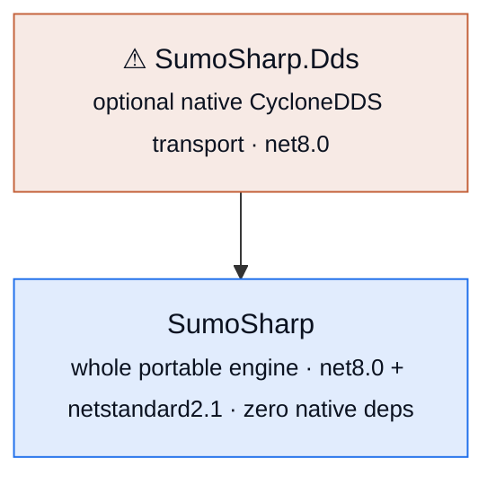
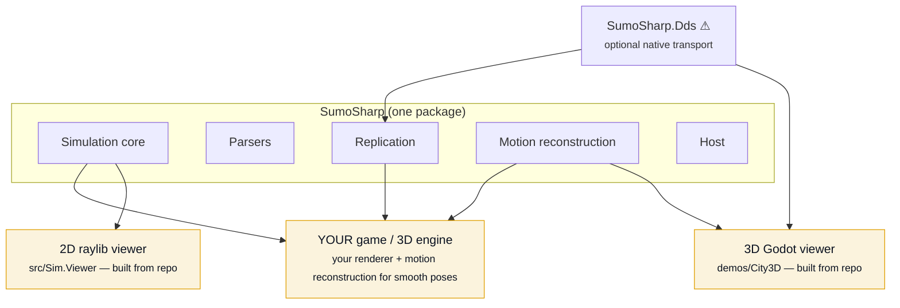
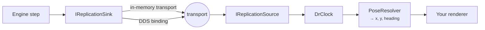

# SumoSharp packages — what to install and how they fit together

**SumoSharp** is SUMO's microscopic traffic simulation, reimplemented in C#/.NET 8. It ships as
**one portable engine package** plus **one optional native transport package** — adoption-first, so a
single `dotnet add package SumoSharp` gets you the whole engine, and the only thing split off is the
native binary a game engine with its own networking would never want to drag in.

> **Unofficial, independent reimplementation of Eclipse SUMO's microscopic simulation core. Not
> affiliated with or endorsed by the Eclipse SUMO project.** Dual-licensed
> `EPL-2.0 OR GPL-2.0-or-later` (see [Licensing](#licensing)).

---

## The package map

Arrows mean **"depends on."** ⚠ marks a **native** package (pulls a platform-specific binary);
`SumoSharp` itself is pure managed and portable (`net8.0` **and** `netstandard2.1`, so Unity/Godot can
consume it).


```mermaid
flowchart TD
    Engine["SumoSharp<br/><small>whole portable engine · net8.0 + netstandard2.1 · zero native deps</small>"]
    Dds["⚠ SumoSharp.Dds<br/><small>optional native CycloneDDS transport · net8.0</small>"] --> Engine

    classDef portable fill:#1f6feb22,stroke:#1f6feb,color:#0b1220;
    classDef native fill:#c4623b22,stroke:#c4623b,color:#0b1220;
    class Engine portable;
    class Dds native;
```

| Package | What it is | TFMs | Native? | Depends on |
|---|---|---|:--:|---|
| **`SumoSharp`** | The whole portable engine in one package — simulation core, parsers/data-model, the replication layer, render-side motion reconstruction, the snapshot→wire host, the ORCA pedestrian crowd, the coupled "live city" host, and the panic-evacuation extension. This is the package a Unity/Godot/.NET consumer installs. | net8.0 · ns2.1 | — | — |
| **`SumoSharp.Dds`** ⚠ | The **optional** native CycloneDDS transport binding — DDS as your wire. Install only if you want it; a game engine that brings its own networking does not. | net8.0 | native | `SumoSharp` |

### What's inside `SumoSharp`

One package, everything portable:

- **Simulation core** — load a SUMO `.net.xml`, spawn/route vehicles, deterministic and async
  stepping, a data-oriented (struct-of-arrays) read API.
- **Parsers & data model** — `.net.xml` / `.rou.xml` / `.sumocfg` ingestion and the immutable network
  + demand model.
- **Replication layer** — a transport-neutral dead-reckoning wire model: compact records, a packed
  codec, an adaptive publish policy, a `.simrec` record/playback format, and the
  `IReplicationSink`/`IReplicationSource` transport contract with an in-memory transport.
- **Render-side motion reconstruction** — `DrClock` / `KinematicReconstructor` turn sparse samples
  into smooth per-frame poses in *your own* renderer.
- **Host** — the snapshot→wire publisher that drives replication from a running engine.
- **Pedestrians** — an ORCA pedestrian crowd layer.
- **LiveCity** — the coupled cars + pedestrians "live city" host.
- **Evac** — the panic-evacuation extension over the unchanged parity core.

---

## Which package do I install?

| You are… | Install |
|---|---|
| A game / 3D engine with its own renderer | `SumoSharp` |
| A headless simulation / training / digital-twin backend | `SumoSharp` |
| A server / co-hosted engine streaming to a decoupled renderer | `SumoSharp` |
| …and you want **DDS** as the wire transport | `+ SumoSharp.Dds` |
| Someone who just wants to *watch* it | the viewers build **from the repo** — not a package (see below) |

```bash
dotnet add package SumoSharp        # the whole engine (portable, zero native deps)
dotnet add package SumoSharp.Dds    # optional: native DDS wire transport
```

### The viewers are not packages — they build from the repo

- **2D raylib desktop viewer** — `src/Sim.Viewer`. Run:
  `dotnet run --project src/Sim.Viewer -- <args>`.
- **3D Godot city viewer** — `demos/City3D`. Build with `demos/City3D/build.sh`, run with
  `demos/City3D/run-local.sh`. It consumes the `SumoSharp` package (and `SumoSharp.Dds` for the
  remote/DDS path) from a **local NuGet feed** that `build.sh` populates — a real package-consumer
  test, end to end. See [`demos/City3D/README.md`](../demos/City3D/README.md).

---

## How the pieces compose

The components inside `SumoSharp` are building blocks. Here's how they assemble into the things you
actually run — your own game integration and the viewers that ship in this repo.


```mermaid
flowchart TD
    subgraph pkg["SumoSharp (one package)"]
        Core2["Simulation core"]; Ingest2["Parsers"]; Repl2["Replication"]; Motion2["Motion reconstruction"]; Host2["Host"]
    end
    Dds2["SumoSharp.Dds ⚠<br/><small>optional native transport</small>"] --> Repl2

    Core2 --> Game["YOUR game / 3D engine<br/><small>your renderer + motion reconstruction for smooth poses</small>"]
    Motion2 --> Game
    Repl2 --> Game

    Core2 --> Viewer2D["2D raylib viewer<br/><small>src/Sim.Viewer — built from repo</small>"]
    Motion2 --> ViewerGodot["3D Godot viewer<br/><small>demos/City3D — built from repo</small>"]
    Dds2 --> ViewerGodot

    classDef out fill:#e0a10622,stroke:#e0a106,color:#0b1220;
    class Game,Viewer2D,ViewerGodot out;
```

Your own game does exactly what the viewers do: take the engine + the motion reconstruction from
`SumoSharp`, draw with your engine's renderer, and reach for `SumoSharp.Dds` only if you want DDS on
the wire.

### The streaming / motion data flow

When the renderer is decoupled from the engine (another process, or a networked client), the
replication contract carries state and the motion reconstruction rebuilds smooth motion from it — all
inside `SumoSharp`, with the transport chosen at the edge:


```mermaid
flowchart LR
    Step["Engine step"] --> Sink["IReplicationSink"]
    Sink -->|in-memory transport| Net(("transport"))
    Sink -->|DDS binding| Net
    Net --> Src["IReplicationSource"]
    Src --> Clock["DrClock"]
    Clock --> Pose["PoseResolver<br/><small>→ x, y, heading</small>"]
    Pose --> Draw["Your renderer"]
```

`IReplicationSink`/`IReplicationSource` are the transport contract; the **in-memory transport ships in
`SumoSharp`**, and **DDS is one optional binding** (`SumoSharp.Dds`) — your consumer code talks to the
interface, never to a DDS type, so switching transports never touches the render code.

---

## Getting started

Install the engine:

```bash
dotnet add package SumoSharp
```

Everything below comes from that one package.

### 1. Hello traffic — load a network, step, read positions

```csharp
using Sim.Core;

var engine = new Engine();
engine.LoadNetwork("scenarios/15-reroute/net.net.xml");        // the parsers read the network

// define a deterministic car type, then spawn two routed vehicles (edge ids come from your .net.xml)
var car = engine.DefineVType(new VTypeParams { Sigma = 0.0, MaxSpeed = 13.89 }, id: "car");
engine.SpawnVehicle(car, fromEdge: "SA", toEdge: "DE");        // routed by the built-in shortest path
engine.SpawnVehicle(engine.DefaultVType, fromEdge: "AB", toEdge: "DE");

for (int step = 1; step <= 20; step++)
{
    engine.Step();                                             // advance one simulated second
    foreach (var h in engine.VehicleHandles)
        if (engine.TryGetVehicle(h, out VehicleState v))
            Console.WriteLine($"t={engine.CurrentTime,5:F1}s  {v.VehicleId,-6}  " +
                              $"lane={v.LaneId,-6} ({v.X,7:F1},{v.Y,7:F1})  {v.Speed,5:F2} m/s");
}
```

For a game/async loop, use `SimulationRunner` instead of `Step()`: `runner.Tick()`, read the
struct-of-arrays `runner.Snapshot`, and `runner.TryInterpolateVehicle(handle, renderTime, out v)` for
render-time interpolation. **▶ Runnable:** [`samples/HelloTraffic`](../samples/HelloTraffic) ·
game-integration facade: [`samples/SumoSharp.GameHostSample`](../samples/SumoSharp.GameHostSample).

### 2. Stream state without a network

The replication API is transport-neutral. Here the **in-memory transport** (shipped in `SumoSharp`)
proves it — publisher and consumer talk to `IReplicationSink`/`IReplicationSource`, not to any DDS type:

```csharp
using Sim.Core;
using Sim.Replication;

var bus = new InMemoryReplicationBus();          // an in-package, non-DDS transport of the same contract

// --- publisher side (your engine host) ---
bus.Sink.PublishGeometry(new[] {
    new GeometryCodec.LaneGeo(1, false, 3.2f, 50f, new[] { (0f, 0f), (50f, 0f) }),
});
var veh = new VehicleHandle(1, 1);
bus.Sink.PublishLifecycle(new LifecycleRecord(veh, isSpawn: true, vTypeId: 0, length: 4.5f, width: 1.8f));

var up  = new UpcomingLanes(stackalloc int[] { 1 });
var rec = new VehicleRecord(veh, DrModel.LaneArc, 1, 12.0, 0.0, 13.9, 0.0, 0.0, up);
bus.Sink.PublishFrame(step: 1, time: 1.0, new[] { rec });

// --- consumer side (viewer / client) — no idea DDS exists ---
bus.Source.Pump();
var hist   = bus.Source.History[veh];
var newest = hist[hist.Count - 1];
Console.WriteLine($"received lane {newest.Record.LaneHandle} @ {newest.Record.Pos} m, " +
                  $"t={newest.TimestampSeconds}s  (dims {bus.Source.Dims[veh]})");
```

Add `SumoSharp.Dds` and swap `InMemoryReplicationBus` for the DDS binding — the consumer code is
unchanged. **▶ Runnable:** [`samples/StreamingLoopback`](../samples/StreamingLoopback).

### 3. Reconstruct smooth motion in your renderer

A decoupled renderer sees sparse samples (1–10 Hz) but draws at 60 fps. `DrClock` picks/interpolates a
render-time state from an `IVehicleSampleHistory`, `PoseResolver` turns it into `(x, y, heading)` along
the lane geometry, and `DrPoseSmoother` absorbs reconciliation snaps — all in `SumoSharp`:

```text
DrClock.Pump(newestSampleTime)            // advance a monotonic render clock
state = DrClock.Resolve(history, delay)   // interpolate/extrapolate a render-time DrState
pose  = PoseResolver.Resolve(lanes, state, ...)   // -> world (x, y, heading)
pose  = DrPoseSmoother.Smooth(prev, pose, dt)     // capped correction + heading tilt
```

The full mechanism, tunables, and a 3D-viewer recipe are in
[`SUMOSHARP-VIEWER-DR-SMOOTHING.md`](SUMOSHARP-VIEWER-DR-SMOOTHING.md) (also shipped as the package
README). It's exercised live by the 2D raylib viewer (`src/Sim.Viewer`).

---

## Examples & samples in this repo

The runnable, copy-to-learn projects live in [`samples/`](../samples); where a feature has no standalone
sample yet, it's exercised by a repo demo (run from a clone) — noted honestly below.

| Component of `SumoSharp` | Runnable example | How to run |
|---|---|---|
| Simulation core | [`samples/HelloTraffic`](../samples/HelloTraffic) — load, step, print positions | `dotnet run --project samples/HelloTraffic` |
| Simulation core (game facade) | [`samples/SumoSharp.GameHostSample`](../samples/SumoSharp.GameHostSample) — Unity/Godot-shaped `GameHost` (Tick / GetRenderVehicles / Spawn / AddObstacle) | `dotnet run --project samples/SumoSharp.GameHostSample` |
| Replication | [`samples/StreamingLoopback`](../samples/StreamingLoopback) — in-memory publish→receive | `dotnet run --project samples/StreamingLoopback` |
| Parsers | via HelloTraffic (parses the net) | — |
| Motion reconstruction | [`demos/City3D`](../demos/City3D) — a Godot 4 3D city viewer that consumes the `SumoSharp` package as a real package consumer | `demos/City3D/build.sh && demos/City3D/run-local.sh` |
| 2D viewer / DDS transport | the 2D raylib viewer (repo run; `SumoSharp.Dds` for the DDS path) | `dotnet run -c Release --project src/Sim.Viewer -- --mode local samples/junctions/cross/net.net.xml` |
| Evac | *no standalone sample yet* | `dotnet run -c Release --project src/Sim.Viewer -- --demo "…evac…"` |
| Testing helpers | *no standalone sample yet* — consume the FCD parsers + comparators from your test project | — |
| `demos/City3D` | a real package-consumer end to end (local co-hosted + remote/DDS), consuming `SumoSharp` (+ `SumoSharp.Dds` remotely) from a local feed | see [`demos/City3D/README.md`](../demos/City3D/README.md) |

**Repo demos** (run from a clone, not package installs): a browser live viewer
(`src/Sim.LiveHost`), an offline HTML replay generator (`src/Sim.Viz`), external-agent injection
(`src/Sim.ExtDemo`), benchmarks (`src/Sim.Bench`, `src/Sim.BenchCity`), and the native demo tool
(`src/Sim.Viewer`). See the repo [`README.md`](../README.md) "Visual demos" section.

> **Honest status:** `HelloTraffic`, `StreamingLoopback`, and `GameHostSample` cover the core, parsers,
> and replication as package-style consumers. Motion reconstruction, the viewers, evac, and the testing
> helpers are currently demonstrated only through the repo's run-from-clone demos — standalone consumer
> samples for them are a good next addition.

---

## Building & publishing the packages

- **Every push** runs [`ci.yml`](../.github/workflows/ci.yml): build + the hermetic parity test
  suite + a determinism-hash check.
- **[`pack-check.yml`](../.github/workflows/pack-check.yml)** (push / manual) builds **and packs both
  packages** — the portable `SumoSharp` and the native `SumoSharp.Dds` — and uploads them as a build
  artifact. It **never publishes**; it's how you confirm packaging is healthy.
- **[`publish.yml`](../.github/workflows/publish.yml)** runs only on a `v*` tag: it gates on the
  parity suite, packs both packages at the tag's version, and pushes `.nupkg` + `.snupkg` to
  nuget.org (push is skipped, not failed, when `NUGET_API_KEY` is absent, so forks can dry-run).

The design of record for this two-package layout — and the rationale (decisions E1–E6) — is
[`SUMOSHARP-PACKAGING-DESIGN.md` §V2](SUMOSHARP-PACKAGING-DESIGN.md).

---

## Licensing

Dual-licensed **`EPL-2.0 OR GPL-2.0-or-later`** — SumoSharp is a derivative work of Eclipse SUMO and
cannot be relicensed to MIT/Apache. EPL-2.0 is **weak, file-level copyleft**: a proprietary game or
app **may** link SumoSharp and keep its own source closed, but must keep the SUMO-derived files under
EPL and publish modifications *to those files*. **This is not legal advice — get counsel for
commercial use.**
