# SumoSharp — what it adds on top of SUMO

The written companion to the slide deck. Same spine, more prose: the deck is for the room, this is for
reading afterwards. Diagrams referenced by number live in [`svg/`](svg/).

**Audience:** technically-oriented stakeholders and engineers who will build against it.
**Posture:** everything here is a proof of concept. Many mechanisms, all working, none polished — and
§13 explains why that is the correct state rather than an apology.

**How this maps to the slide deck.** The deck (`build_deck.sh` → `SumoSharp-features.pptx`) carries
the same argument in the same order, with one diagram per slide and the takeaway below it. Two
differences are deliberate:

- The deck groups pedestrian material by theme, so §3.4 (city life) and §3.5 (the wire) appear as
  their own slides late in the deck rather than nested under pedestrians as they are here.
- §7 (real city) and §11 (rail and integration) have no diagram and therefore no slide. They are
  spoken to, not shown. This document is where they are written down.

**A note on numbers.** Three different classes of evidence appear below and they are deliberately worded
differently, because conflating them is the fastest way to lose a technical audience:

| Class | The figure | How to read it |
| --- | --- | --- |
| **Owner-verified routine operation** | **10 000 vehicles + 30 000 pedestrians** in the 3-D viewer | Repeated first-hand use, not a captured run. The strongest evidence that it *works*, and the headline scale claim here. |
| **Instrumented and reproducible** | **0.64 replication updates per car per second** | Has a committed tool and a session log. Anyone can re-run it and get this number. |
| **Captured single run** | **0 of 2000 frames** over 3× the median | One measurement with a CSV behind it. True, and true only about that run. |

---

## 1. The premise: parity first, everything else layered

*Diagram 01.*

SumoSharp reproduces SUMO's microscopic algorithms in C#/.NET on a data-oriented ECS. The algorithms are
copied faithfully; what is rebuilt is the *memory layout* and the *timing of structural mutations*.

That matters for one reason: it is what makes everything else in this document safe to add.

- **661 committed goldens**, matched every step. `pos` and `speed` to 1e-3; `lane` by exact match.
- The goldens **are** the executable spec — the offline test loop never invokes SUMO and passes on a
  machine with no SUMO installed.
- **Determinism is a gate, not an aspiration:** the benchmark's hash is asserted equal between the
  single-threaded and parallel runs.
- **Faster per tick than SUMO.** On a 7 632-vehicle city, single-threaded SUMO takes 17.19 s for the
  simulation tick; the region-parallel path at 8 cores takes ≈4.82 s — **3.57×**. Part of that is
  parallelism and part is simply being leaner per tick.

**The load-bearing design rule is that every extension is inert when absent.** The pedestrian layer, the
coupling, the evacuation model and the terrain all attach through public seams and are gated on being
switched on. With them off, the goldens and the determinism hash do not move. That is why we can add a
whole behavioural model without putting parity at risk — and why "we changed the crowd" is never an answer
to "did the cars change?"

> **Don't overstate this in the room.** The 661 byte-identical goldens are small scenarios — a handful of
> vehicles each. The city-scale performance runs are validated against SUMO to a *statistical* aggregate
> tolerance, not byte-for-byte. Both are real; they are different claims and should not be blurred.

**Takeaway.** 661 committed goldens matched every step, and every extension is inert when switched off. That is what makes the rest of this document safe to add.

---

## 2. The seam SUMO does not have

*Diagram 02.*

SUMO has no concept of an agent it does not control. Everything in a SUMO run is something SUMO spawned.

SumoSharp adds **external agents**: obstacles and movers injected lane-relative, which the cars then
*react* to with their ordinary car-following model. A pedestrian, a crowd, a live detection, anything you
can express as a footprint on a lane.

The reactions escalate the way a driver's would: brake to a safe gap behind it; treat a moving one as a
dynamic leader or as a reason to veto a lane change; and when braking alone will not do, swerve within the
lane, then spill into a gap-safe adjacent lane, then stop.

Two design details matter more than the feature list:

- **Obstacles are frozen once per step**, so the outcome does not depend on the order you added them. That
  is what lets the whole thing survive parallel execution.
- **The API is handle-based and generation-validated.** You get a handle back and keep it; calling update
  or remove on a stale one is an inert no-op rather than a crash or, worse, a write to a recycled slot.

This single seam is what everything in §3 and §4 hangs off.

**Takeaway.** Obstacles are frozen once per step, so the outcome never depends on insertion order — which is what lets the whole thing survive parallel execution.

---

## 3. Pedestrians — a crowd layer, not a port

*Diagrams 03, 05, 15.*

[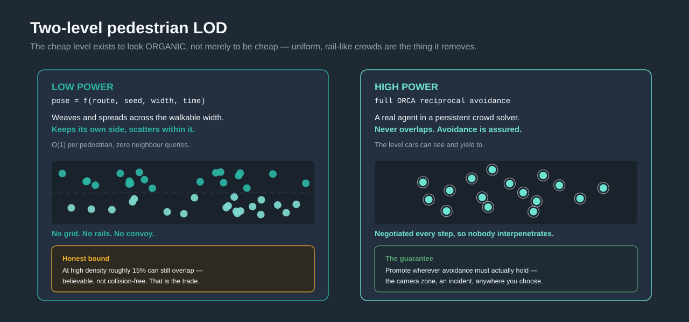](svg/03-lod.svg)
[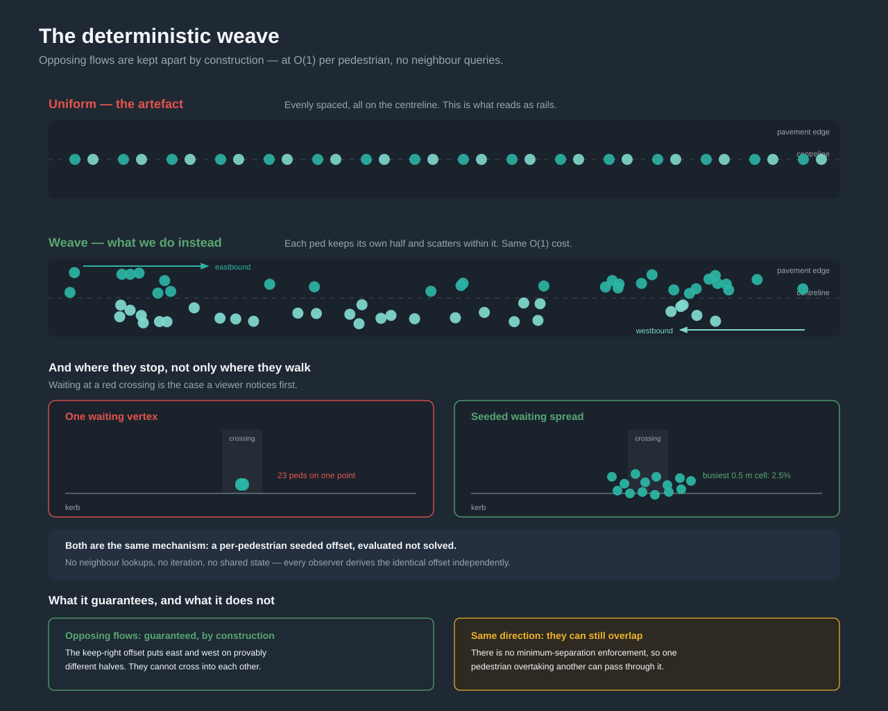](svg/05-weave.svg)
[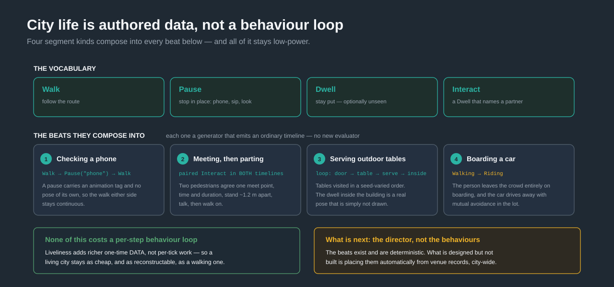](svg/15-liveliness.svg)

This is **not** a port of SUMO's person model, and that is the point rather than a caveat. There is no
golden pedestrian trajectory to match; the layer is validated by behavioural and property tests instead.

### 3.1 Why the cheap level exists

The obvious reason to have a cheap pedestrian is cost. The real reason is **appearance**.

SUMO's person model produces motion that reads as *rails*: uniform, evenly spaced, mechanical. In a 3-D
scene that is immediately and fatally unconvincing — a viewer forgives a lot, but not a convoy of
identically-spaced people marching down a pavement.

So the low-power pedestrian is not "a simplified solver". It is a **closed-form pose**: a pure function of
`(route, seed, width, time)`. Because the lateral offset is part of that function, low-power pedestrians
**weave and spread across the walkable width**, keeping to their own side while scattering within it. No
grid, no rows, no convoy — and O(1) per pedestrian with **zero** neighbour queries.

**The honest bound:** at high density roughly **15%** can still overlap. It is believable, not
collision-free. That is the trade, made on purpose.

### 3.2 The two levels

| | Low power | High power |
| --- | --- | --- |
| Motion | closed-form pose, evaluated | full ORCA reciprocal avoidance |
| Cost | O(1)/ped, no neighbour queries | usual crowd-solver cost |
| Promise | **believable** — weaves, spreads, keeps its side | **assured** — never overlaps |
| Visible to cars | only on a crossing (see §4) | yes, everywhere it exists |

Pedestrians move between levels through an **interest field**. Promotion and demotion use **different
radii plus a dwell time** — spatial *and* temporal hysteresis. That is not fussiness: with one shared
radius, a pedestrian standing on the boundary flips level every single step and visibly pops between
motion models.

[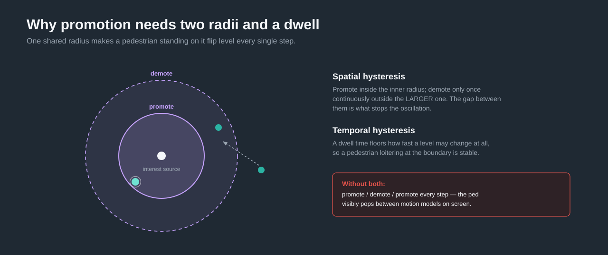](svg/04-hysteresis.svg)

### 3.3 What the weave guarantees, and what it does not

*Diagram 05.* Worth stating precisely, because it is the claim most likely to be tested on screen.

- **Opposing flows: a structural guarantee.** The keep-right offset places east- and west-bound
  pedestrians on provably different halves of the path. They **cannot** cross into one another. This is a
  property of the construction, not a tendency.
- **Same direction: they can still overlap.** There is no minimum-separation enforcement, so one
  pedestrian overtaking another can pass through it. Visually clean at moderate density and degrading as
  density rises.

Same-direction avoidance is open work. Promoting to full ORCA is what makes avoidance *assured* today.

The same spreading applies where crowds **bunch**, not only where they flow: waiting at a red crossing
used to stack every pedestrian on a single kerb vertex, which is the artefact a viewer notices first. A
per-pedestrian seeded waiting spread turns that stack into a natural blob.

### 3.4 City life is authored data, not a behaviour loop

*Diagram 15.* Four segment kinds — **Walk, Pause, Dwell, Interact** — compose into every beat:

- **Checking a phone** — a `Pause` carrying an animation tag, with no pose of its own, so the walk either
  side stays continuous.
- **Meeting someone, then parting** — a paired `Interact` written into *both* pedestrians' timelines, with
  one agreed meet point, separation and duration.
- **Serving outdoor tables** — a looping door → table → serve → inside schedule, tables visited in a
  seed-varied order. The dwell inside the building is a real pose that simply is not drawn.
- **Boarding a car and driving away** — the person leaves the crowd entirely on boarding, while the lot
  handles mutual car/pedestrian avoidance.

**None of this adds a per-step behaviour loop.** Liveliness adds richer *one-time data*. A living city
costs what a walking city costs, and stays exactly as reconstructable.

What is designed but **not** built is the *director* — placing these beats automatically across a whole
city from venue records. The vocabulary exists; the authoring at scale is the next increment.

### 3.5 The crowd is nearly free on the wire

*Diagram 09.* Because a low-power pose is a pure function of its inputs, the simulation server and every

[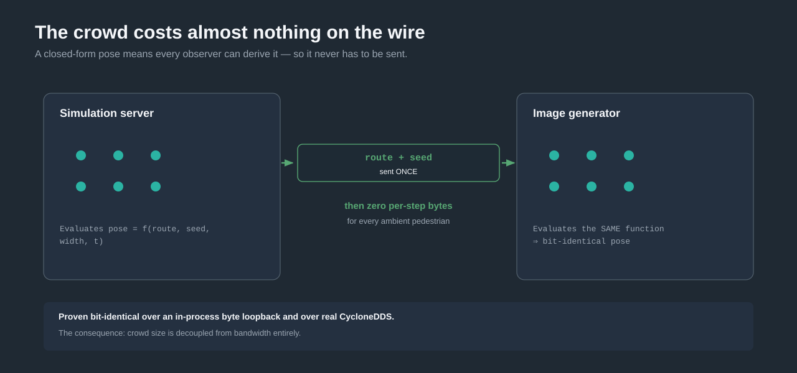](svg/09-server-ig.svg)
remote image generator evaluate the *same* function and get **bit-identical** results. A route or timeline
is broadcast **once**; ambient pedestrians then emit **zero per-step bytes**. Proven over an in-process
byte loopback and over real DDS.

The consequence: **crowd size is decoupled from bandwidth entirely.**

**Takeaway.** The point of the cheap level is anti-uniformity. Pedestrians should never read as a grid or as rails; each keeps its own half of the walkable width and scatters within it, from its own seed, with no neighbour queries at all.

---

## 4. What a car can and cannot see

*Diagram 06.* Coupling is a level-of-detail decision, not a feature list. **This section's message is the trade, not the plumbing.**

[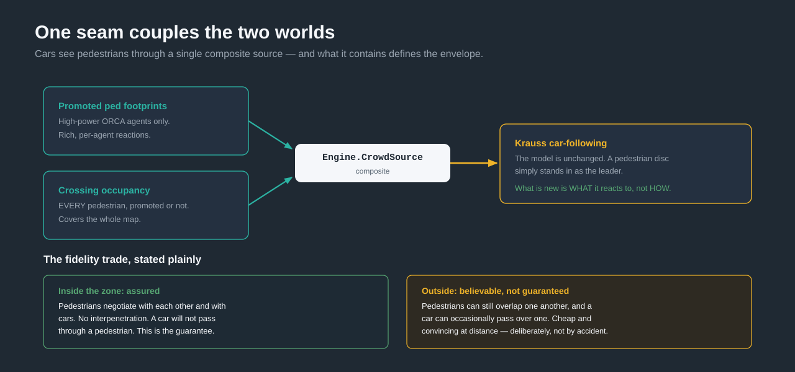](svg/06-coupling.svg)

Cars see pedestrians through one composite source. What it contains defines exactly what the simulation
can and cannot promise, so it is worth being blunt:

**Inside a high-realism zone: assured.** Pedestrians are promoted to full ORCA. They negotiate with each
other and cars yield to them. No interpenetration; a car will not pass through a pedestrian.

**Outside it: believable, not guaranteed.**
- Same-direction pedestrians can overlap one another (§3.3).
- A car can pass over a pedestrian that is **not on a crossing**.
- On a crossing, a car *does* stop — crossing occupancy covers low-power pedestrians walking across, which
  is the case that matters most and the one an audience will look for.

This is performance bought with *believability*, not with *correctness*, and it is the same
level-of-detail trade every real-time engine makes. Stated up front it reads as engineering. Discovered
under questioning it reads as a defect — so state it up front.

The mechanism itself is unremarkable in the best way: the car-following model is unchanged, with a
pedestrian disc standing in as the leader. What is new is *what* it reacts to, not *how*. Yielding also
looks at where the pedestrian **will be** rather than only where it is, because a current-overlap test
cannot see a conflict that has not happened yet (*diagram 07*).

[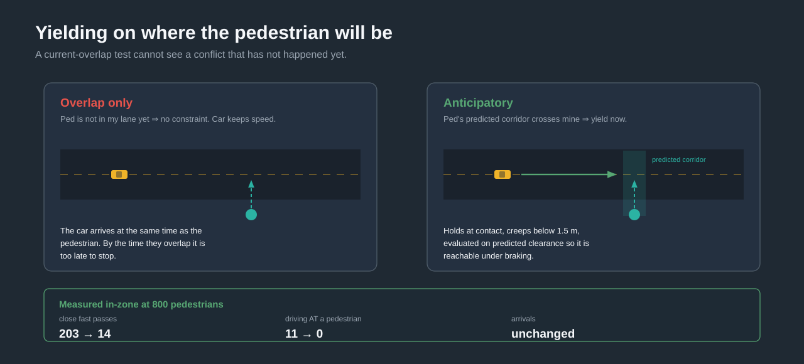](svg/07-yield.svg)

**Takeaway.** Inside a realism zone: assured, no interpenetration. Outside it: believable, not guaranteed. Performance bought with believability, never with correctness.

---

## 5. Cost follows attention, not city size

*Diagram 13.*

[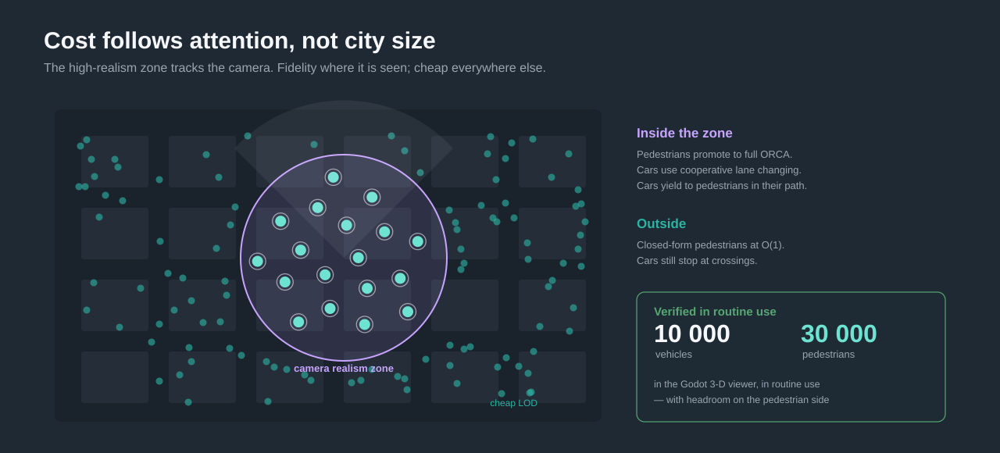](svg/13-attention.svg)

The realism zone tracks the camera. Inside it, pedestrians promote to full ORCA and cars use cooperative
lane changing. Outside, pedestrians stay closed-form and cars still stop at crossings.

This is the scalability answer, and it is a better one than "we made everything fast": **fidelity is spent
where it is observed.** A city does not get more expensive because it is large; it gets more expensive
where someone is looking.

**Verified in routine use: 10 000 vehicles and 30 000 pedestrians** in the Godot 3-D viewer, with headroom
on the pedestrian side.

Multiple and overlapping camera zones are designed and not yet built — a clean next increment.

**Takeaway.** A city does not get more expensive because it is large. It gets more expensive where someone is looking.

---

## 6. How the work is spread across cores

*Diagram 11.*

[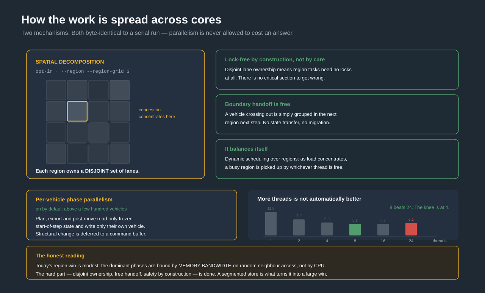](svg/11-spatial.svg)

Two independent mechanisms, both byte-identical to a serial run.

**Per-vehicle phase parallelism, on by default at scale.** The plan, export and post-move phases read only
frozen start-of-step state and write only their own vehicle's intent; structural changes are deferred to a
command buffer. They are therefore race-free *by construction* rather than by locking, and auto-parallelise
above a few hundred concurrent vehicles. Small scenarios stay serial.

**Spatial decomposition, opt-in.** The network is partitioned into a grid of regions, and **each region
owns a disjoint set of lanes** — so region tasks need no locks at all, again by construction rather than by
care. Two properties make it practical:

- **Load balances itself.** Dynamic scheduling over regions means that as congestion concentrates, busy
  regions are simply picked up by whichever thread is free. Finer grids give smaller working sets and
  better balance.
- **Boundary handoff is free.** A vehicle that crosses into another region is simply grouped there next
  step. There is no state transfer, no migration protocol, nothing to get wrong.

It parallelises the plan, junction, movement-execute and neighbour-refill phases, and it is off by default
so the deterministic path is untouched.

**The honest reading:** today's region win is modest, because the dominant phases are bound by *memory
bandwidth on random neighbour access* rather than by CPU. The foundation — disjoint ownership, free handoff,
thread-safety by construction — is the part that is done and hard. Turning it into a large win needs a
segmented store that keeps each region's neighbours contiguous, which is designed and not built.

**And more threads is not automatically better.** On a 16-core/24-thread hybrid box, the measured sweep has
**8 threads beating 24**, with the efficiency knee around 4. In the viewer this matters twice over: an
engine that saturates every core starves the renderer, so the tick deliberately leaves cores free.

**Takeaway.** Each region owns a disjoint set of lanes, so region tasks are lock-free by construction rather than by care — and a vehicle crossing a boundary needs no state transfer at all.

---

## 7. Running on a real city

Not a hand-built scenario: any SUMO network, a preprocessed crop, or a whole config.

**Georeferenced worlds are handled.** A city cut sitting at UTM coordinates around 9×10⁴ loses fine detail
entirely under naive single-precision rendering. The world is recentred, which recovers sub-millimetre
resolution.

**The ground is real.** A terrain field is baked from the network's *own* lane elevations on load — no
external heightmap, no separate asset pipeline. Everything on the ground then follows it for free: the
grid, tinted zones, points of interest, doors, building bases, traffic-light poles. On a test cut with
27.5 m of relief it reproduces every lane vertex's height to **0.326 m**, against up to ~14 m of error from
a flat datum.

**Pedestrians know which surface they are on.** Height travels with per-vertex surface provenance along the
route the pedestrian actually walks, rather than being guessed from the nearest surface. On a footbridge
fixture, a pedestrian crossing the bridge reads 412.5 m while one walking underneath reads 400.0 m — at the
same plan-view point.

**Density is live.** Car and pedestrian counts change without rebuilding the simulation, which is what the
viewer's sliders drive.

**Takeaway.** The ground is derived from the network you already loaded. No external heightmap, no second asset pipeline, and pedestrians know which surface they are standing on.

---

## 8. Smooth motion at a low update rate

*Diagram 10.*

[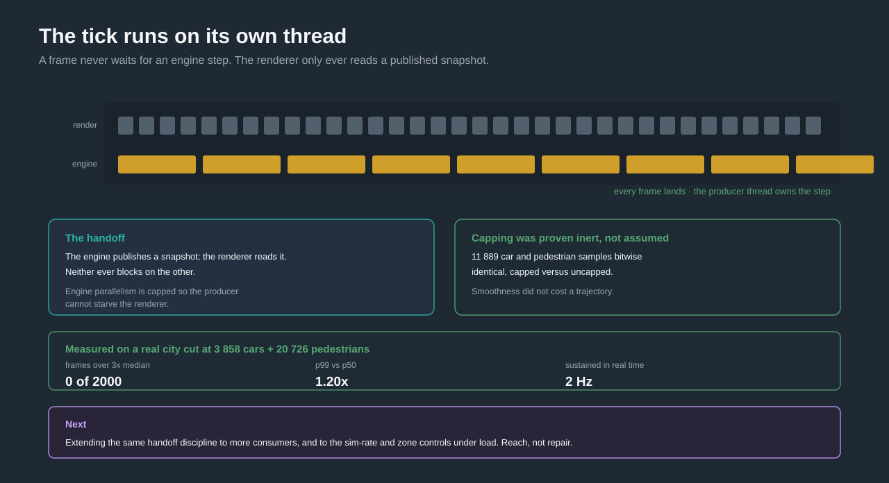](svg/10-threaded.svg)

The simulation runs on its **own thread**; the render thread only ever reads a published snapshot, so a
frame never waits for an engine step. Engine parallelism is capped so the producer cannot starve the
renderer — and capping it was proven trajectory-inert, not assumed: **11 889 car and pedestrian samples
bitwise identical**, capped versus uncapped.

Measured on a real city cut at **3 858 cars + 20 726 pedestrians**: **0 of 2000** frames exceeded 3× the
median, p99 was **1.20×** p50, and 2 Hz was sustained in real time.

The remaining work here is about *reach* rather than repair — extending the same handoff discipline to more
consumers, and to the sim-rate and zone controls under load.

**Takeaway.** Capping engine parallelism to protect the renderer was proven trajectory-inert — 11 889 samples bitwise identical, capped versus uncapped. Smoothness cost nothing.

---

## 9. Dead reckoning: 48 bytes buys a trajectory

*Diagram 14.*

The receiver is never told where a car *is*. It is told enough to work out where it *will be*.

**Sent once, up front (durable, so a late joiner needs no network file):**
- **Lane geometry** — per lane: identity, width, length, centreline points. For a whole city cut, **2.86
  MiB**, once. This is what makes 48 bytes per update sufficient.
- **Per agent on spawn** — identity, type, dimensions. Physical size never travels in a per-frame packet.
  A pedestrian's route or timeline is also sent once.

**Sent per update:**
- **Car: 48 B** — lane and arc-position, speed, acceleration, lateral position and speed, and the next few
  lanes ahead. That is a *trajectory* the receiver integrates, not a sample it interpolates.
- **Reactive pedestrian: 18 B.**
- **Ambient pedestrian: 0 B.**

**Sent when?** Only when dead reckoning would otherwise be wrong: the predicted position has drifted past
a tolerance, the lane identity changed, or a liveliness heartbeat elapsed. A genuinely steady car diverges
from its own prediction by almost nothing, so nothing is sent.

**What that saves.** A naive pose-per-rendered-frame stream needs 60 updates per car per second. One packet
per simulation step would be 2. Measured on a real cut: **0.64 per car per second** — about **94× fewer
messages than the render rate**, with motion still reconstructing smoothly at 60 fps. At 4 000 cars the
whole vehicle stream is **~125 KiB/s**. Thirty thousand ambient pedestrians add nothing.

Bandwidth is simply not the constraint, and should be dropped from the argument.

> **One counter-intuitive finding**, because it changes where optimisation effort should go. About half the
> updates are triggered by a change of *lane identity* — and only ~0.7% of all updates are a real lateral
> lane change. The rest is cars driving straight onto the next lane, or across a junction's internal lanes.
> On a dense urban cut where most lanes are short internal junction lanes, that is unavoidable: position on
> the wire is measured *along a specific lane*, so a new lane must be published. It is a property of the
> network's granularity, not of the traffic, and no publish threshold reaches it.

[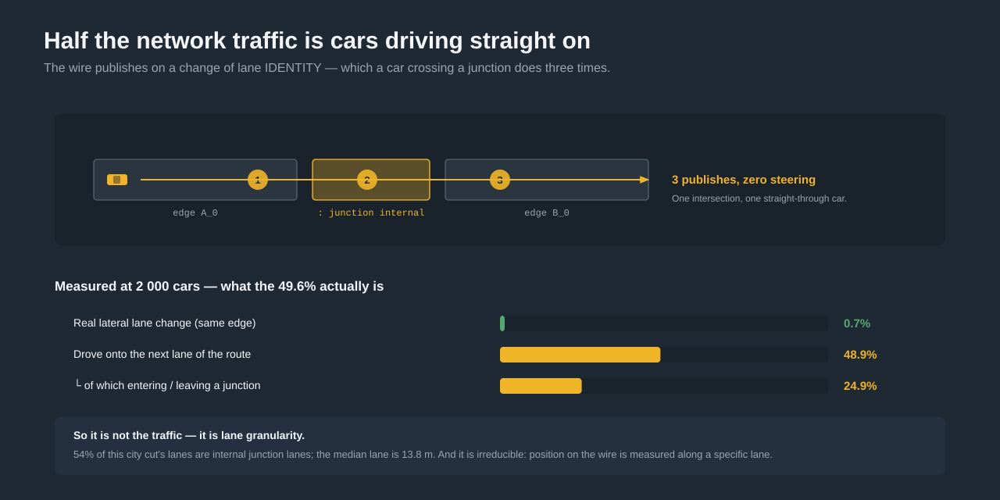](svg/08-lanechange.svg)

**Takeaway.** 0.64 updates per car per second, about 94× fewer messages than the render rate, with motion still reconstructing smoothly at 60 fps. Ambient pedestrians send nothing at all.

---

## 10. Beyond traffic: evacuation

*Diagram 12.* The proof that the layering works — a complete behavioural model on a **completely

[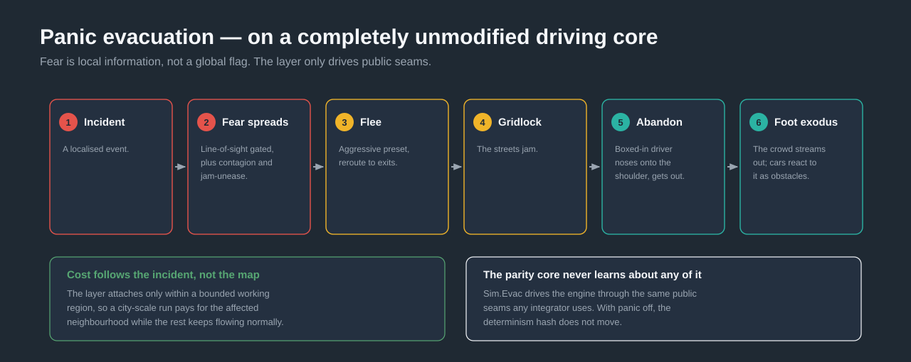](svg/12-evac.svg)
unmodified** driving core.

On a localised incident, fear spreads as **local information**: occlusion-gated line of sight, contagion
between drivers, and unease from being stuck — never a global broadcast. Nearby drivers switch to an
aggressive preset and reroute toward exits. The streets jam. A boxed-in driver noses onto the shoulder,
then **abandons the car** and its occupants flee on foot. The crowd streams outward, and cars react to both
the pedestrians and the abandoned vehicles as obstacles.

Two properties are worth naming:

- **Cost follows the incident, not the map.** The layer attaches only within a bounded working region, so a
  city-scale run pays for the affected neighbourhood while the rest keeps flowing normally.
- **The core never learns about any of it.** The evacuation layer drives the engine through the same public
  seams any integrator would use. With panic off, the determinism hash does not move.

**Takeaway.** This is the proof that the layering works: a whole behavioural model driving the engine through the same public seams any integrator would use, and with panic off the determinism hash does not move.

---

## 11. Rail, and how you integrate

**Rail is first-class**, which is unusual: signals with block reservation, level crossings, bidirectional
single track with a deadlock guard, and a traction model — all held to the same exact parity bar as the
road model.

**Packaging is à-la-carte.** The engine core targets both modern .NET and `netstandard2.1`, so Unity and
Godot can consume it directly. Native dependencies are quarantined in leaf packages you opt into, so
nothing forces DDS or a windowing library on a headless host.

**Four ways to see it run:** a self-contained offline HTML replay; a live browser viewer; a native desktop
viewer built for 10 000-vehicle scale; and the Godot 3-D city. All four are outside the parity test
solution, so the hermetic test gate never touches them.

**One shared motion reconstructor** turns a sparse, low-rate stream into believable per-frame motion — a
no-slip rear-axle model so the body pivots like a real car, with look-ahead through junctions. Both the
native and Godot viewers use it, so a fix lands in both at once. There is also a producer-side feed for an
image generator that does no prediction of its own: the smoothing is baked in before the wire.

**Takeaway.** Rail is held to the same exact parity bar as the road model, and one shared motion reconstructor means a fix lands in every viewer at once.

---

## 12. Already fast, and the headroom is already located

*Diagram 16.* The emphasis is deliberately on the shape of the situation rather than on a wall of figures.

[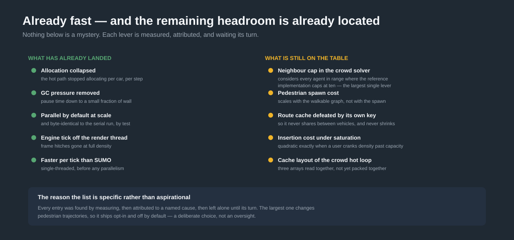](svg/16-headroom.svg)

**What has landed:** allocation on the hot path collapsed; GC pressure down to a small fraction of wall
time; parallel by default at scale and byte-identical by test; the engine tick off the render thread; and
faster per tick than SUMO even single-threaded.

**What is still on the table** — each one measured, attributed to a named cause, and left alone until its
turn:

| Lever | Situation |
| --- | --- |
| Neighbour cap in the crowd solver | Considers every agent in range where the reference implementation caps at ten. The crowd step is around half of wall time on crowd-heavy scenes, so this is the largest single lever. **It changes pedestrian trajectories, so it ships opt-in and off by default** — a deliberate choice. |
| Pedestrian spawn cost | Scales with the walkable graph rather than with the spawn. |
| Route cache defeated by its own key | Never shares between vehicles and never shrinks. |
| Insertion cost under saturation | Quadratic exactly when a user pushes density past capacity. |
| Cache layout of the crowd hot loop | Three arrays read together, not yet stored together. |
| Segmented store for spatial regions | The thing that would turn §6's foundation into a large win. |

The list is specific rather than aspirational because every entry came out of a measurement. That is the
point: **there is a lot of headroom and we know where it is.**

**Takeaway.** There is a lot of headroom and we know exactly where it is. Nothing on that list is a mystery — each entry is measured and attributed to a named cause.

---

## 13. Current state: a substrate, not a finished product

*Diagram 17.*

[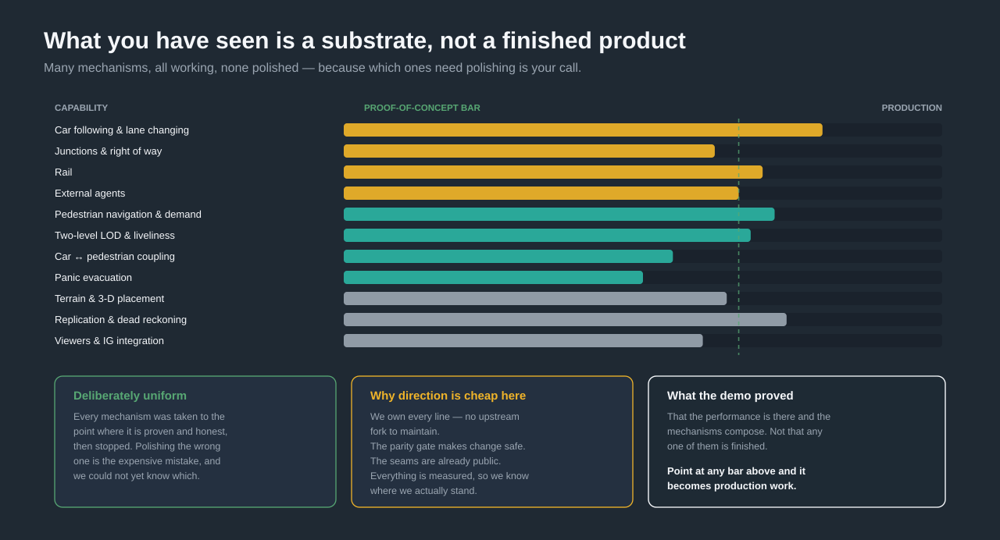](svg/17-substrate.svg)

Everything above is a proof of concept. Many mechanisms, all working, **none perfected** — and that is the
correct state rather than a shortfall.

**Why.** Polishing the wrong mechanism is the expensive mistake, and which ones matter was not knowable in
advance. So each was taken to the point where it is proven and honest, then stopped. The result is unusual
breadth at a deliberately uniform depth.

**The open items, stated plainly:**

- Same-direction low-power pedestrians can overlap; assured avoidance means promoting to ORCA.
- Outside a realism zone, cars do not see pedestrians that are off a crossing.
- Junction discharge trails SUMO's: at the same inflow our halting fraction matches almost exactly (33.3%
  against 33.7%) and the routes are identical, yet trips take longer because our cars *roll* slower
  (~8.0 m/s against ~11.0). Localised, and being chased with a per-vehicle trace rather than another
  hypothesis.
- A long-standing car-to-car overlap of about 3 m on internal junction lanes, present before this work and
  not a regression.
- The full lateral/sublane model is deferred: continuous lane-change *timing* is landed and parity-exact,
  the lateral *position* model is not.

**Why redirecting is cheap.** We own every line — there is no upstream fork to maintain, so none of the
above is a dependency on someone else's roadmap. The parity gate makes change safe. The seams are already
public. And everything is measured, so we know where we actually stand.

**Point at any of it and it becomes production work.**

**Takeaway.** Point at any of it and it becomes production work.

---

## 14. The demonstrations

Deliberately last: they land far harder once the audience knows what to look for.

**Impression — the real image generator on real city terrain**, at around a thousand vehicles and a
thousand pedestrians. The point is not scale but *plausibility*: terrain-following ground, pedestrians at
correct heights weaving on the pavements rather than marching, cars yielding at crossings.

Watch for the things §3.1 and §4 set up: nobody moves on rails, and nothing about the crowd reads as a
grid.

**Performance — the Godot 3-D viewer on the same city**, at full scale. This is where the 10 000 vehicles
and 30 000 pedestrians are real rather than quoted, and where §5's claim becomes visible: the camera zone
moves, fidelity follows it, and the frame rate does not care how large the city is.

**Takeaway.** Both demos run the same engine. The difference is only where fidelity is being spent.

---

## Appendix: reading the diagrams

Colour carries meaning across the whole set — learn it once:

| | |
| --- | --- |
| **Amber** | vehicles |
| **Teal** | pedestrians (low power) |
| **Bright teal with a halo** | pedestrians promoted to high power |
| **Violet** | the attention / realism-zone construct |
| **White** | the untouched SUMO parity core |
| **Red** | a limit or a refuted idea |
| **Green** | a measured outcome |

Sources and the generator are in [`svg/`](svg/) and [`gen_svg.py`](gen_svg.py); see
[`README.md`](README.md) for the conventions and the traps.
